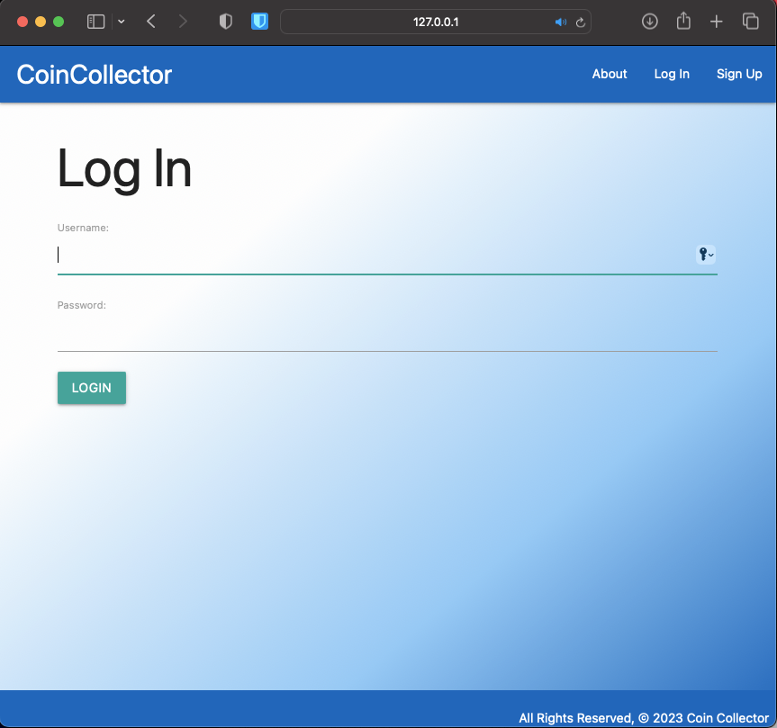
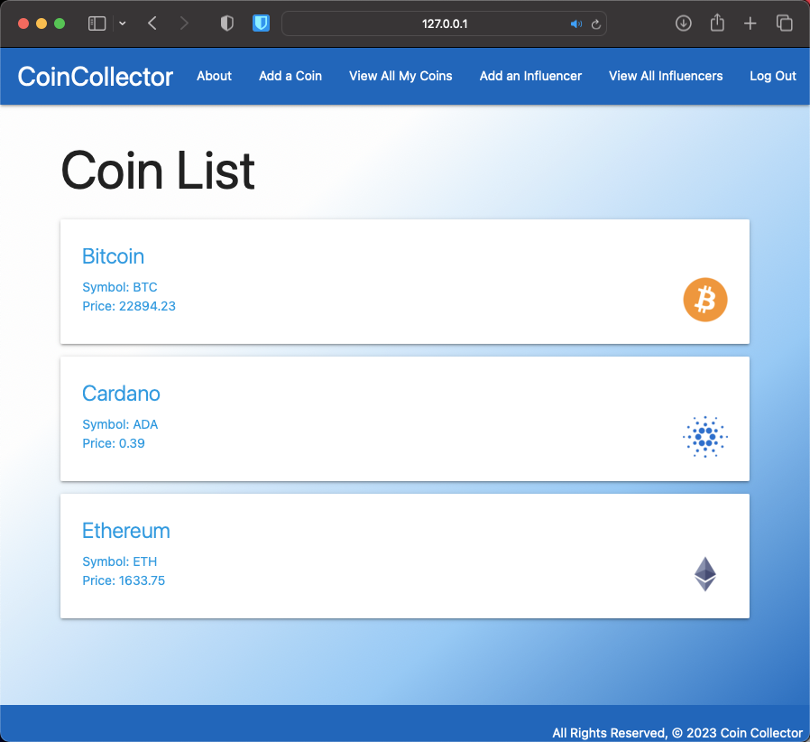
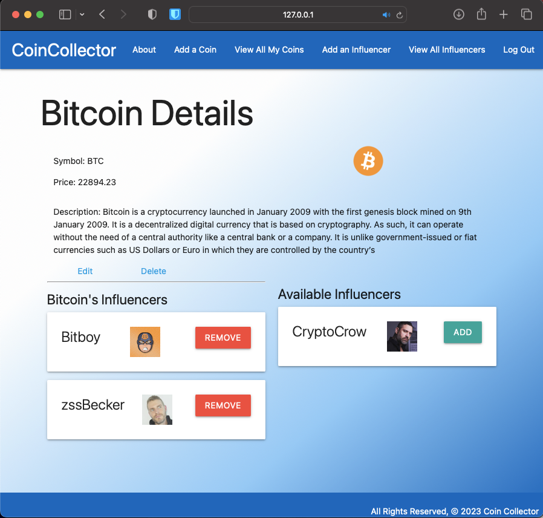
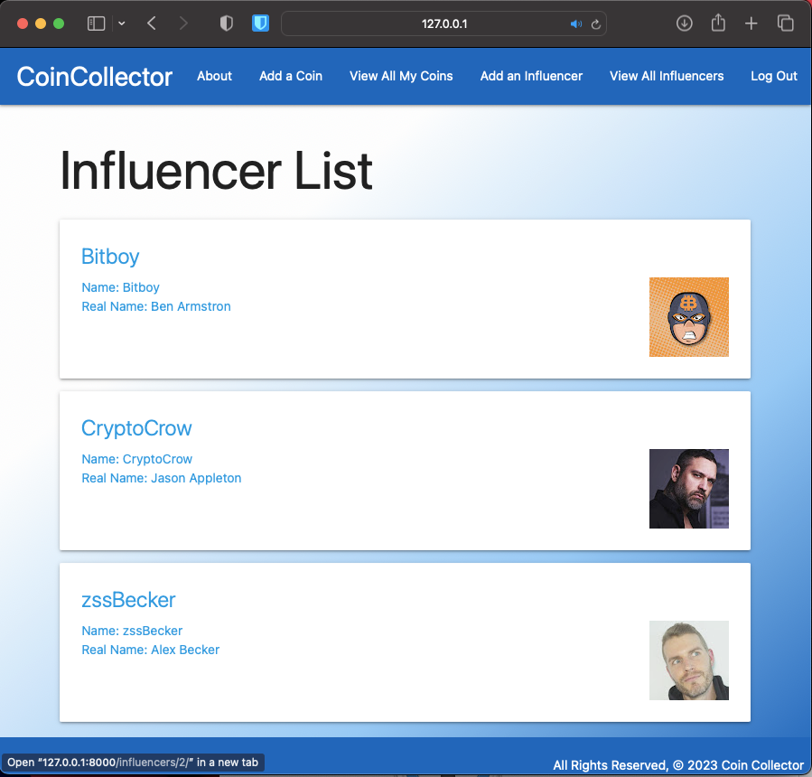
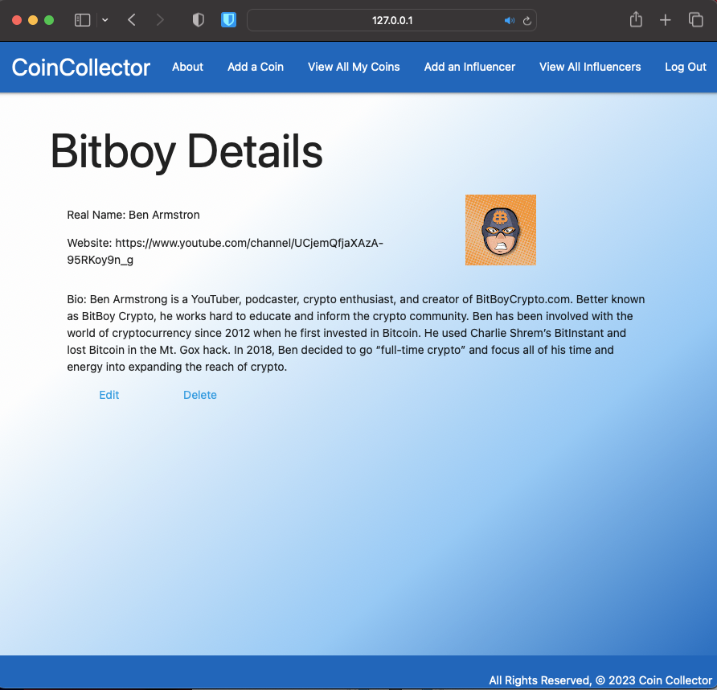

# CryptoList
--- 

CoinCollector is an early stage beta for a crypto currency research and portfolio management solution. The primary purpose of this app is to beta demo Python and Django interactions. This project is based on an automated spreadsheet used to manage cryptocurrency research, price monitoring, and portfolio management over a six year period from 2016 to 2022. 

## Technologies Used: 
--- 

- HTML
- CSS
- Python
- Django
- [Materialize] (https://materializecss.com/)

## Screenshot(s):
--- 
CoinCollector Main Page:

## Getting Started: 
--- 

A live version of this app is hosted on <TBD>

### Features:
--- 
- [x] Authentication
  - [X] Login/Logout
  - [X] Sign Up
- [ ] 3 Models
  - [x] Coin
  - [x] Influencer
  - [ ] Media
- [ ] One-to-many relationship
  - [ ] Influencer to Media
- [X] Many-to-many relationship
  - [X] Coin to Influencer
- [x] Admin View
  - [x] Ability to add, edit, and delete coins
  - [X] Ability to add, edit, and delete influencers
  - [x] Ability to add, edit, and delete media
- [x] User input form
  - [x] Currency Name, Symbol, CoinGeck API Key
  - [x] Error handling and help alert
- [x] AJAX query to CoinGecko
- [x] Basic Reporting
  - [x] Currency List
  - [x] Ability to Remove Currencies from the List
- [x] Local Storage of User Input
  - [x] Ability to "Clear Local Storage"
  
### Future Enhancements:

App will be refactored for use in a future Django project.

## Project MVP Description and Rubric
--- 

- [ ] One-to-many relationship (ex: cats to feedings)
- [x] Many-to-many relationship (ex: cats to toys)
- [ ] 3 Models (ex: cats, feedings, toys)
- [x] Admin View
- [x] Authentication

